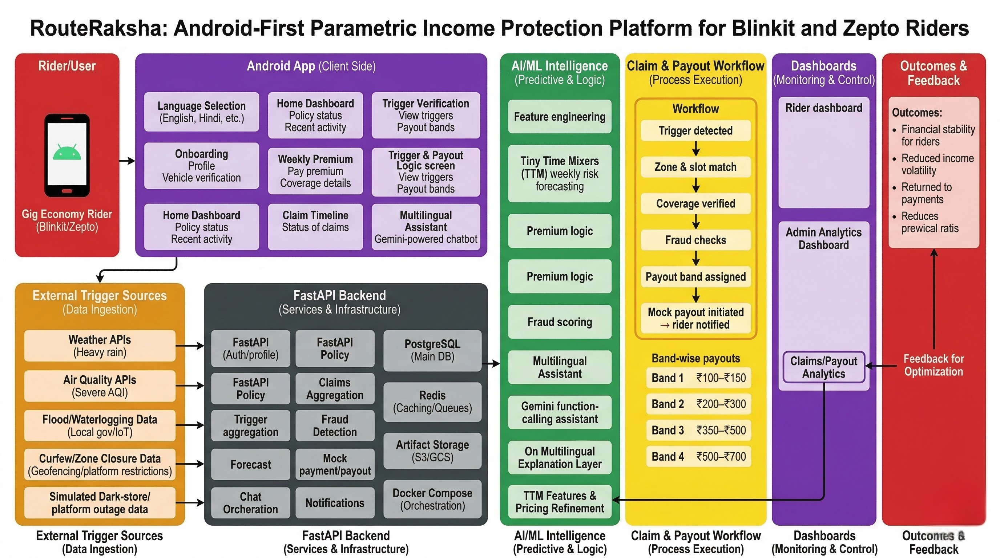

# GuideWire-Blitz
### RouteRaksha — Android-First Parametric Income Protection for Blinkit and Zepto Riders



RouteRaksha is a multilingual, Android-first parametric income protection concept for **Blinkit and Zepto delivery riders**. It is designed to protect **weekly earnings** when external disruptions (heavy rain, severe AQI, flood/waterlogging, curfew/zone closure, and dark-store/platform outage) reduce rider workability.

This project is prepared for **DEVTrails 2026 Phase 1** under:

> **Ideate & Know Your Delivery Worker**

---

## Table of Contents
- [Problem Statement](#problem-statement)
- [Target Persona](#target-persona)
- [Solution Overview](#solution-overview)
- [Why Mobile First](#why-mobile-first)
- [Parametric Triggers](#parametric-triggers)
- [Weekly Premium Model](#weekly-premium-model)
- [Payout Logic](#payout-logic)
- [Persona-Based Scenarios](#persona-based-scenarios)
- [Application Workflow](#application-workflow)
- [AI/ML Integration](#aiml-integration)
- [Adversarial Defense & Anti-Spoofing Strategy](#adversarial-defense--anti-spoofing-strategy)
- [Dashboards](#dashboards)
- [Multilingual Accessibility](#multilingual-accessibility)
- [UI/UX Design Direction](#uiux-design-direction)
- [Architecture Overview](#architecture-overview)
- [Tech Stack](#tech-stack)
- [Development Plan](#development-plan)
- [Phase 1 Minimal Scope](#phase-1-minimal-scope)
- [What Makes RouteRaksha Different](#what-makes-routeraksha-different)
- [Repository Structure](#repository-structure)
- [Submission Links](#submission-links)

---

## Problem Statement
Quick-commerce riders depend on weekly earnings. Their income drops when uncontrollable external disruptions happen:
- heavy rainfall,
- severe air pollution,
- flooded/inaccessible roads,
- administrative curfew/zone closure,
- dark-store/platform operational outages.

Current protection models are not focused on short-cycle, trigger-based income disruptions for this worker segment.

---

## Target Persona
### Primary Persona: Urban Blinkit/Zepto Rider
- Android smartphone user
- Works fixed city zones and repeated time slots
- Thinks in weekly earning cycles
- Needs fast, simple, local-language explanations

### Why this persona?
This rider group faces concentrated operational and environmental risk and is highly suitable for weekly parametric protection.

---

## Solution Overview
RouteRaksha is an Android-first weekly income protection workflow that:
- activates weekly coverage,
- tracks objective external triggers,
- forecasts weekly disruption risk using AI/ML,
- recommends a weekly premium,
- auto-creates claims for valid trigger overlap,
- applies fraud/activity checks,
- maps outcomes to transparent payout bands.

---

## Why Mobile First
### Why Android?
- highest practical accessibility for rider segment
- shift-time usage and alerts are mobile-native
- location-linked workflows and low-network behavior fit app model
- multilingual support is easier to operationalize in app journeys

### Why not web-first?
Rider workflows are on-shift, field-based, and notification-driven. Web can be added later for admin analytics.

---

## Parametric Triggers
1. **Heavy Rain Threshold Crossed**
2. **Severe AQI Threshold Crossed**
3. **Flood / Waterlogging Alert**
4. **Government Curfew / Sudden Zone Closure**
5. **Platform Disruption / Dark-Store Outage (simulated in Phase 1)**

These are measurable, external, automatable, and directly tied to earning disruption.

---

## Weekly Premium Model
### Formula
**Weekly Premium = Base Premium + Zone Risk Loading + Slot Exposure Loading + Seasonal Risk Loading − Trust Discount**

### Prototype Premium Bands
- **Low Risk:** ₹19–₹25
- **Medium Risk:** ₹29–₹39
- **High Risk:** ₹45–₹59

(Prototype values for Phase 1 demonstration.)

---

## Payout Logic
Payout is parametric and band-based (not reimbursement-style).

### Inputs
- trigger type & severity,
- event duration,
- insured-slot overlap,
- policy validity,
- fraud/activity checks.

### Bands
- **Band 1 (Minor):** ₹100–₹150
- **Band 2 (Medium):** ₹200–₹300
- **Band 3 (Major):** ₹350–₹500
- **Band 4 (Extreme):** ₹500–₹700

---

## Persona-Based Scenarios
- **A. Heavy Rain Evening Shift:** likely Band 2
- **B. Severe AQI Metro Slot:** Band 2/3
- **C. Flooded Zone Access Loss:** Band 3
- **D. Curfew Zone Closure:** Band 3/4
- **E. Dark-Store Outage:** Band 2/3

---

## Application Workflow
1. Rider selects language
2. Rider picks platform (Blinkit/Zepto)
3. Rider enters city, zone, slot, earning band
4. App computes weekly risk + premium suggestion
5. Rider activates weekly plan
6. Backend monitors triggers
7. Trigger overlap detected
8. Policy + validity + fraud checks run
9. Claim created automatically
10. Payout band assigned
11. Rider receives local-language status update

---

## AI/ML Integration
- **Weekly risk forecasting:** Tiny Time Mixers (TTM)
- **Premium recommendation:** explainable risk-to-price mapping
- **Fraud checks:** rules + anomaly signals
- **Assistant support:** multilingual explanation of premium, claim status, and payout logic

AI supports explainability and automation, while core payout logic remains deterministic and auditable.
Fraud detection in RouteRaksha goes beyond duplicate claims and basic GPS validation. The platform uses multi-signal anti-spoofing logic combining device, activity, trigger-correlation, and coordinated-pattern analysis.

---

## Adversarial Defense & Anti-Spoofing Strategy

As part of our fraud prevention design, RouteRaksha includes an additional adversarial defense layer to handle coordinated GPS spoofing attacks and false trigger-based payout attempts.

### Why this matters
A major weakness in parametric insurance systems is relying only on GPS coordinates to determine whether a rider was present in an affected zone. A bad actor can spoof location while staying safely at home and attempt to trigger false payouts. Because of this, RouteRaksha does not rely on GPS alone.

### 1. Differentiation: Real stranded rider vs spoofed rider

Our system differentiates between a genuinely affected delivery rider and a spoofing attacker by combining multiple signals instead of trusting one location source.

A genuine stranded rider is expected to show:
- normal shift activation during the insured time slot,
- realistic mobility history before the disruption,
- route or order activity consistent with being on duty,
- zone presence that matches weather and access conditions,
- timing consistency between trigger event and rider activity,
- device behavior consistent with normal app usage.

A spoofing attacker is more likely to show:
- sudden impossible location jumps,
- location present in affected zone without realistic movement history,
- no supporting activity before or during the disruption,
- repeated claims from multiple accounts in the same suspicious pattern,
- inconsistent device or network behavior,
- many claims clustered around the same payout window.

Instead of binary GPS validation, our architecture uses a **multi-signal confidence model** for claim authenticity.

### 2. Data points used beyond GPS

To detect advanced fraud rings, RouteRaksha analyzes multiple data points in addition to location coordinates:

#### Mobility and device consistency
- speed and route continuity
- impossible movement jumps
- background location consistency over time
- device ID / app session continuity
- emulator or suspicious device patterns
- mock location / developer-mode risk flags where available

#### Work and platform activity signals
- shift start and active slot overlap
- order acceptance / order history consistency
- pickup / drop timing patterns
- time since last genuine activity
- dark-store assignment consistency
- rider availability status

#### Network and behavioral signals
- IP / network pattern consistency
- repeated claims from clustered accounts
- abnormal timing of claims across a Telegram-like fraud ring pattern
- many users claiming from the same event with identical behavior
- repeated threshold-edge claims
- account age and prior fraud history

#### Trigger correlation signals
- whether the rider’s timeline matches the actual trigger window
- whether route delay / closure / outage signals support the claim
- whether nearby riders show similar but not identical genuine patterns
- whether the rider’s activity dropped in a realistic way during the disruption

### 3. AI/ML anti-spoofing logic

Our anti-spoofing layer combines:
- rule-based fraud checks,
- anomaly scoring,
- and coordinated-pattern detection.

#### Rule-based checks
- duplicate claim detection
- impossible geo-jumps
- no insured-slot overlap
- no recent rider activity before claim
- same device used across suspicious accounts
- repeated claims without valid behavior trail

#### ML / anomaly features
- unusual location trajectory
- mismatch between claimed zone and historical work zone
- unrealistic stationary pattern in a severe trigger zone
- repeated coordinated claims across nearby accounts
- payout-trigger behavior clustering
- deviation from rider’s normal operating pattern

The fraud engine produces:
- **low risk** → auto-approve
- **medium risk** → soft review
- **high risk** → manual review / temporary hold

### 4. UX balance: protecting honest riders

A strong anti-spoofing system should not unfairly punish honest riders, especially during bad weather or poor network conditions.

To maintain fairness, RouteRaksha does not automatically reject every suspicious claim. Instead, the workflow uses layered handling:

#### Low-risk claims
If the claim matches trigger, slot, and activity patterns clearly, payout proceeds automatically.

#### Medium-risk claims
If some signals are missing due to poor network or device instability, the system places the claim in a **review state** instead of rejecting it. The rider sees a simple message such as:
> “Your claim is being verified due to signal inconsistency. No action is needed right now.”

#### High-risk claims
Claims with strong spoofing indicators are temporarily held and reviewed before payout.

### 5. Honest rider protection mechanisms

To avoid unfair penalties for genuine workers in difficult conditions, the system includes:

- tolerance for temporary GPS drift during heavy rain or weak connectivity,
- acceptance of partial evidence instead of requiring perfect sensor data,
- fallback to recent trusted movement history,
- comparison with zone-level disruption context,
- explainable review messages in local language,
- no immediate harsh penalty for first-time ambiguous cases.

This helps ensure that a genuine rider with poor connectivity is not treated the same as a coordinated fraud attacker.

### 6. Defense against coordinated fraud rings

RouteRaksha is also designed to detect fraud at the **group level**, not only at the individual level.

The system can flag:
- many claims from the same zone with identical suspicious patterns,
- synchronized claim timing,
- repeated device or network overlaps,
- shared abnormal movement signatures,
- coordinated exploitation of the same payout threshold.

This makes the platform more resilient against organized GPS-spoofing groups.

### 7. Architectural impact

This adversarial defense layer strengthens the core platform by adding:
- device and activity-aware fraud signals,
- coordinated-pattern analytics,
- multi-signal authenticity scoring,
- explainable review states,
- and safer payout decisioning.

This ensures RouteRaksha remains practical, fair, and resilient even under advanced spoofing attacks.

---

## Dashboards
### Rider Dashboard
- weekly plan status
- risk level and premium recommendation
- trigger coverage
- claim timeline and payout progress

### Admin / Analytics Dashboard
- zone-wise trigger activity
- claim and payout distribution
- fraud-flag review queues
- premium and risk trend monitoring

---

## Multilingual Accessibility
- language at entry point
- localized key actions and statuses
- bilingual claim/payout screens
- optional voice/read-aloud support concept

---

## UI/UX Design Direction
- Android-first, simple, high-clarity interface
- large touch-friendly components
- status-driven cards and timelines
- quick-commerce inspired visual energy with trust-first readability

### Phase 1 Screen Scope
1. Language Selection
2. Rider Onboarding
3. Home Dashboard
4. Weekly Plan & Premium
5. Trigger & Payout Logic
6. Claim Timeline
7. Multilingual Assistant

---

## Architecture Overview
### Architecture Diagram


### Summary
Android app + trigger ingestion + FastAPI services + forecasting + fraud checks + anti-spoofing layer + claims/payout engine + multilingual assistant + analytics feedback loop.
The architecture also includes an adversarial defense layer for GPS spoofing detection using device, activity, and coordinated-claim analytics.

---

## Tech Stack
### Mobile
- Kotlin
- Jetpack Compose
- Room
- WorkManager
- ML Kit Translation / TTS

### Backend
- FastAPI
- PostgreSQL
- Redis
- Docker Compose

### AI/ML
- Tiny Time Mixers (TTM)
- Rule-based + ML-assisted fraud checks
- Gemini-powered multilingual explainer assistant

### Integrations
- Weather API
- AQI API
- mobility/route signals
- simulated platform outage feed
- mock payout layer

---

## Development Plan
### Phase 1
- persona finalization
- trigger and premium definitions
- 7 core Figma screens
- README + architecture + submission video

### Phase 2
- onboarding and policy flow
- trigger aggregation
- forecast service
- auto claim generation + mock payout flow

### Phase 3
- stronger fraud detection
- anti-spoofing heuristics
- coordinated fraud ring detection
- flagged claim review workflow
- admin dashboard and analytics
- multilingual explanation refinement
- end-to-end demo hardening

---

## Phase 1 Minimal Scope
- rider persona definition
- Android-first app journey (design/prototype)
- weekly premium model
- 5 parametric triggers
- payout band logic
- architecture and AI/ML integration plan
- multilingual support concept

---

## What Makes RouteRaksha Different
- focused only on Blinkit/Zepto riders
- weekly income-loss protection framing
- parametric trigger model for fast claiming
- AI/ML forecasting with explainable recommendations
- fraud-aware automated logic
- multilingual rider-first UX

---

## Repository Structure
```text
GuideWire-Blitz/
├── README.md
├── assets/
│   ├── architecture.png
│   ├── figma-screens.png
│   └── logo.png
├── ui/
└── video/
```

---

## Submission Links
- **GitHub Repository:** https://github.com/Anishkumarpandey757/GuideWire-Blitz
- **UI/UX (Stitch):** https://stitch.withgoogle.com/preview/2838452718460097145?node-id=e07e976898894b4aa4bf8ed2bf0b2f37
- **2-Minute Video:** https://drive.google.com/file/d/1XGGN85sT7lwsViycgGHwR_cT_qluvqAa/view?usp=sharing

---

## Team BLITZ

Build a focused, explainable, multilingual, and rider-friendly weekly income protection system for real-world delivery disruption conditions.
